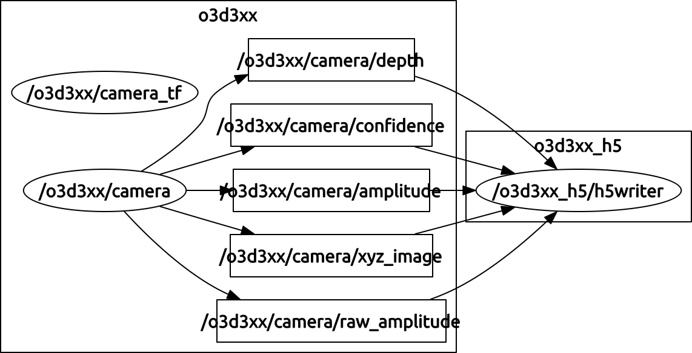

o3d3xx-h5
=========
o3d3xx-h5 is a ROS package for logging O3D3xx camera data, as published by
[o3d3xx-ros](https://github.com/lovepark/o3d3xx-ros), to
[HDF5](https://www.hdfgroup.org/HDF5/). The image data are logged as
multidimensional HDF5 *data sets* and annotated by the JSON dump and topic
header information available in `o3d3xx-ros`. This package can act as a
more capable replacement for the `o3d3xx-ros/file_writer` node. Features
include:

* Data are logged to high-performance HDF5 data store
* Data are stored on-disk GZip compressed (compression level configurable)
* Data are annotated with current camera and ROS topic parameters
* The nature of using HDF5 implicitly provides compatibility with leading
  analysis packages like MATLAB and the scientific Python stack -- most of
  which have strong support for HDF5
* All data lives in a single file (yet organized as a "filesystem in a
  file")
* Parameterization is available to provide an on-disk ring buffer for fixed
  size data capture and usage on long-running production systems

Software Compatibility Matrix
-----------------------------
<table>
    <tr>
        <th>o3d3xx-ros Version</th>
        <th>o3d3xx-h5 Version</th>
        <th>ROS Distribution</th>
    </tr>
</table>

Prerequisites
-------------
1. [o3d3xx-ros](https://github.com/lovepark/o3d3xx-ros)

Building and Installing the Software
------------------------------------
o3d3xx-h5 is a ROS package written in Python. So, there really isn't anything
to build. However, you should still use [catkin](http://wiki.ros.org/catkin) to
install it. These instructions will assume you will check out the code to
`/home/tpanzarella/dev/o3d3xx-h5` and that your catkin workspace is in
`/home/tpanzarella/dev/o3d3xx-h5-catkin` and that you will be installing to a
directory called `${LPR_ROS}/o3d3xx_h5`.

Check out the code:

    $ cd ~/dev
    $ git clone https://github.com/lovepark/o3d3xx-h5.git

Set up the catkin workspace and install:

    $ mkdir o3d3xx-h5-catkin
    $ cd o3d3xx-h5-catkin
    $ mkdir src
    $ cd src
    $ catkin_init_workspace
    $ ln -s ~/dev/o3d3xx-h5 o3d3xx_h5
    $ cd ~/dev/o3d3xx-h5-catkin
    $ catkin_make
    $ catkin_make -DCMAKE_INSTALL_PREFIX=${LPR_ROS}/o3d3xx_h5 install

Running the Software
--------------------
Once installed as above, you can start a roscore:

    $ roscore

Then start up the `o3d3xx-ros/camera` node:

    $ roslaunch o3d3xx camera.launch

Then start up the `o3d3xx_h5` node:

    $ roslaunch o3d3xx_h5 h5writer.launch circular_buffer_sz:=3

__NOTE__: The `circular_buffer_sz` argument is completely optional. See below
for its documentation.

At this point, your ROS computation graph will look like:

You can now stop the `h5writer` node and inspect the captured data
(by default it will go to `/tmp/o3d3xx.h5`) using a tool like `hdfview`:

    $ hdfview /tmp/o3d3xx.h5 &

You will notice that for each of the image topics the `h5writer` node is
subscribed to, only three images/datasets exist. That is the role the
`circular_buffer_sz` argument plays in in the command line above.

Nodes
-----

### /o3d3xx_h5/h5writer

This node handles subscribing to the `o3d3xx-ros` image topics and writing
their data out to the HDF5 output file. This node is started with:

    $ roslaunch o3d3xx_h5 h5writer.launch

#### Subscribed Topics

<table>
    <tr>
        <th>Topic</th>
        <th>Message</th>
        <Description</th>
    </tr>

    <tr>
        <td>/o3d3xx/camera/amplitude</td>
        <td>sensor_msgs/Image</td>
        <td>Data received on this topic are written to
            the HDF5 group: `/o3d3xx/camera/amplitude/XXX`
            where `XXX` is a monotonically increasing integer
            value that may or may not wrap back on intself
            depending upon the size of the circular buffer.
        </td>
    </tr>

    <tr>
        <td>/o3d3xx/camera/confidence</td>
        <td>sensor_msgs/Image</td>
        <td>Data received on this topic are written to
            the HDF5 group: `/o3d3xx/camera/confidence/XXX`
            where `XXX` is a monotonically increasing integer
            value that may or may not wrap back on intself
            depending upon the size of the circular buffer.
        </td>
    </tr>

    <tr>
        <td>/o3d3xx/camera/depth</td>
        <td>sensor_msgs/Image</td>
        <td>Data received on this topic are written to
            the HDF5 group: `/o3d3xx/camera/depth/XXX`
            where `XXX` is a monotonically increasing integer
            value that may or may not wrap back on intself
            depending upon the size of the circular buffer.
        </td>
    </tr>

    <tr>
        <td>/o3d3xx/camera/xyz_image</td>
        <td>sensor_msgs/Image</td>
        <td>Data received on this topic are written to
            the HDF5 group: `/o3d3xx/camera/xyz_image/XXX`
            where `XXX` is a monotonically increasing integer
            value that may or may not wrap back on intself
            depending upon the size of the circular buffer.
        </td>
    </tr>

</table>

#### Parameters

<table>
    <tr>
        <th>Name</th>
        <th>Data Type</th>
        <th>Defualt</th>
        <th>Description</th>
    </tr>

    <tr>
        <td>ns</td>
        <td>string</td>
        <td>o3d3xx_h5</td>
        <td>Determines the namespace for the node.</td>
    </tr>

    <tr>
        <td>nn</td>
        <td>string</td>
        <td>h5writer</td>
        <td>Determines the node name.</td>
    </tr>

    <tr>
        <td>outdir</td>
        <td>string</td>
        <td>`/tmp`</td>
        <td>Output directory for the hdf5 file</td>
    </tr>

    <tr>
        <td>outfile</td>
        <td>string</td>
        <td>o3d3xx.h5</td>
        <td>Output hdf5 file name</td>
    </tr>

    <tr>
        <td>open_mode</td>
        <td>string</td>
        <td>w-</td>
        <td>An HDF5 valid open-mode. Sensible options include: `w` (create
        file, truncate if it exists), `w-` (create file, fail if it exists),
        `a` (read/write, create otherwise).
        </td>
    </tr>

    <tr>
        <td>compression</td>
        <td>int</td>
        <td>9</td>
        <td>GZip compression level to apply: 0 - 9 where 9 is most compressed.
        </td>
    </tr>

    <tr>
        <td>circular_buffer_sz</td>
        <td>int</td>
        <td>999999999</td>
        <td>
        Puts a limit on how many images (per type) get written to the HDF5
        file.
        </td>
    </tr>

    <tr>
        <td>camera_ns</td>
        <td>string</td>
        <td>o3d3xx</td>
        <td>
        Allows customizing the camera namespace to connect to.
        </td>
    </tr>

    <tr>
        <td>camera_nn</td>
        <td>string</td>
        <td>camera</td>
        <td>
        Allows customizing the camera node name to connect to.
        </td>
    </tr>

    <tr>
        <td>suffix</td>
        <td>string</td>
        <td></td>
        <td>
        Allows customizing the camera node name suffix to connect to.
        </td>
    </tr>
</table>

TODO
----

Please see the [Github Issues](https://github.com/lovepark/o3d3xx-h5/issues).

LICENSE
-------

Please see the file called LICENSE

AUTHORS
-------

[Tom Panzarella](mailto:tom@loveparkrobotics.com)
